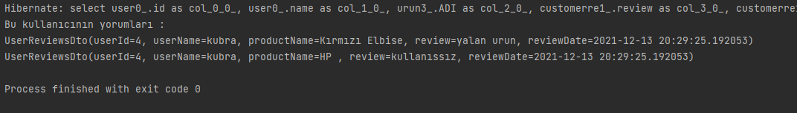
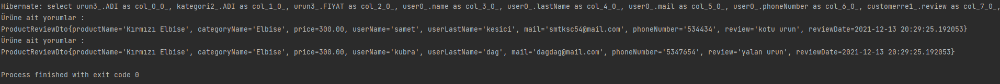
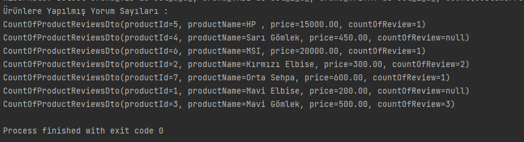

# Ödev 1 

## İçerikler
* [Ekran Görüntüleri](#ekran-görüntüleri)
* [Kullanım](#kullanım)
* [Proje Durumu](#proje-durumu)

## Ekran Görüntüleri

<!-- If you have screenshots you'd like to share, include them here. -->

## Kullanım

`Öncelikle n11_bootcamp adında bir veritabanı oluşturulmalı ve resources klasöründeki hibernatecfg.xml deki konfigürasyonlar( şifre ve kullanıcı adı) özelleştirilmelidir.`

`Projeyi klonladıktan sonra tabloları oluşturması amacıyla herhangi bir application'da 1 kere çalıştırmalıdır.`

`Daha sonra hibernatecfg.xml üzerinde "<property name="hibernate.hbm2ddl.auto">create</property>" create kısmı update olarak değiştirilmelidir.`

`Veritabanına ise gerekli dataları setlemek için resources klasöründeki all_data_instert.sql ' da bulunan datalar veritabanındaki query tool üzerinde çalıştırılmalıdır.`

`Daha sonra Intelij Idea üzerinde applicationlar çalıştırılabilir. `

## Proje Durumu
Project is: _complete_

